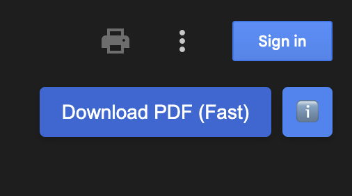
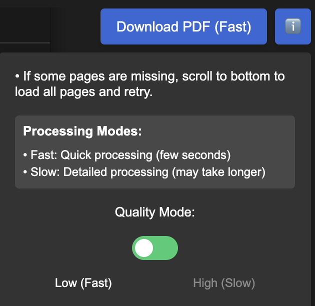

# Enhanced Google Drive PDF Downloader
A powerful userscript that enables downloading view-only PDFs from Google Drive with quality control options and real-time progress tracking. 

## 🎯 Use Case
- Download PDF files from Google Drive that are in "preview" mode
- Ideal for situations where direct download is disabled
- Works with documents containing text, images, and mixed content
- Perfect for students and researchers who need to save reference materials

## ✨ Features
- **Two Quality Modes**
  - Fast Mode: Quick processing, suitable for text-heavy documents
  - High Quality Mode: Detailed processing, better for documents with images
- **Progress Tracking**
  - Real-time page processing indicators
  - Clear visual feedback during download
- **User-Friendly Interface**
  - Intuitive toggle for quality settings
  - Information tooltip with usage instructions
  - Clean, modern design matching Google Drive's aesthetic
- **Smart Processing**
  - Automatic page orientation detection
  - Maintains original document dimensions
  - Preserves image quality

## 📝 Installation Steps

1. Install a userscript manager:
   - For Chrome: [Tampermonkey](https://chrome.google.com/webstore/detail/tampermonkey/dhdgffkkebhmkfjojejmpbldmpobfkfo)
   - For Firefox: [Greasemonkey](https://addons.mozilla.org/en-US/firefox/addon/greasemonkey/)

2. Install the script:
   - Click [here](https://raw.githubusercontent.com/Akv2021/Enhanced-Google-Drive-PDF-Downloader/refs/heads/main/script.user.js) to install (add your script installation link)
   - Or copy the script content and create a new userscript in your manager

## 🚀 How to Use

1. Open a PDF file in Google Drive

2. The download button will appear in the top-right corner
   

3. (Optional) Select quality mode:
   - Click the info icon (ℹ️)
   - Toggle between Fast/High Quality
   

4. Click "Download PDF"
   - Make sure to scroll through the document first to load all pages
   - Wait for the processing to complete

## ⚠️ Important Notes
- **Document Loading**: Scroll through the entire document before downloading to ensure all pages are loaded
- **Processing Time**: High Quality mode may take longer, especially for large documents
- **Browser Compatibility**: Tested on Chrome and Firefox with latest versions
- **Page Limits**: Performance may vary with very large documents (100+ pages)

## 🔧 Troubleshooting

Common issues and solutions:

| Issue | Solution |
|-------|----------|
| Missing pages | Scroll through entire document first |
| Slow processing | Switch to Fast mode for quicker results |
| Download fails | Refresh page and try again |
| Blank pages | Make sure images are fully loaded |

## 🆕 Version History

### v2(Current)
- Added quality mode toggle
- Improved progress indicators
- Enhanced error handling

### v1
- Basic download functionality
- Fixed page orientation issues
- Added processing status messages

## 📄 License
MIT License - feel free to modify and distribute

## 🤝 Contributing
Contributions are welcome! Please feel free to submit a Pull Request.

## 🙏 Credits
- Uses [jsPDF](https://github.com/MrRio/jsPDF) library

---

For issues and feature requests, please [create an issue](https://github.com/Akv2021/Enhanced-Google-Drive-PDF-Downloader/issues)
